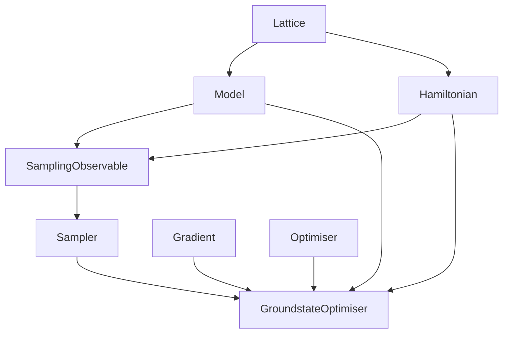
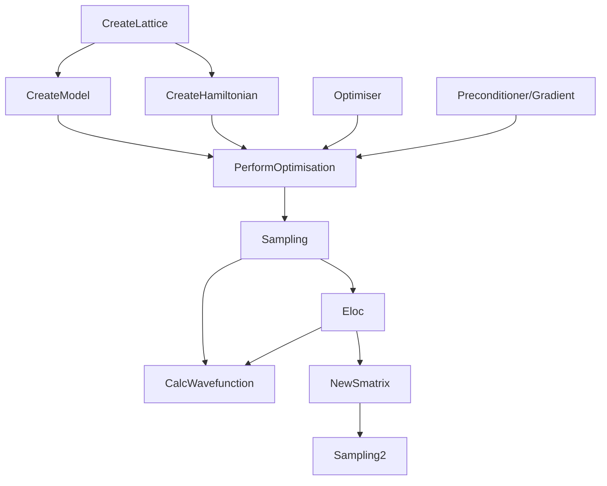

```mermaid
graph TD;
    Lattice-->Model;
    Lattice-->Hamiltonian;
    Model-->SamplingObservable;
    Hamiltonian-->SamplingObservable;
    SamplingObservable --> Sampler
    Sampler --> GroundstateOptimiser 
    Hamiltonian --> GroundstateOptimiser 
    Model --> GroundstateOptimiser 
    Gradient --> GroundstateOptimiser
    Optimiser --> GroundstateOptimiser
```

```mermaid
graph TD;
    CreateLattice-->CreateModel
    CreateLattice-->CreateHamiltonian
    CreateModel-->PerformOptimisation
    CreateHamiltonian-->PerformOptimisation
    Optimiser-->PerformOptimisation
    Preconditioner/Gradient-->PerformOptimisation
    PerformOptimisation-->Sampling
    Sampling-->CalcWavefunction
    Eloc-->CalcWavefunction
    Sampling-->Eloc
    Eloc-->NewSmatrix
    NewSmatrix-->Sampling2
```